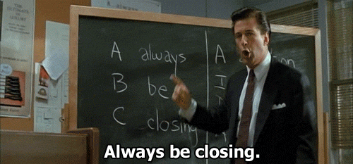

<!-- Bring a TedX "poster" -->


```ruby
include Trialbee

author = Presenter.new(:jacob)
slides = Portal::Slides.new

wait until author.ready?

author.present(slides) do |slide|
  print slide
  any_questions? if slide.last?
end
```

---

# First of all thank you

---


## Jacob Burenstam

* Full stack developer
* OSS tinkerer
* Bitcoin.org translator
* Useless code enthusiast

<hr>

* GitHub: [github.com/buren](https://github.com/buren)
* Keybase: [keybase.io/buren](https://keybase.io/buren)

---

## Full stack developer?


```note
Full stack can mean pretty much whatever these days.
```

---

## Langs & Tools

Started out with Java @ LTH.

* Ruby
* JavaScript
* Clojure

---

## Libraries

* meta-secretary
* Wayback archive
* SiteMapper
* Chartkick.js
* git-story

```note
* Track deployments

* Send URLs to Wayback Machine

* Map all links on a site

* JavaScript charting library

* Normalized git environment & utils
```

---

## Slides available on

```
please-open() {
 xdg-open "$1" || open "$1" # Ubuntu or OSX
}

slides='http://jacobburenstam.com/abh'
please-open slides

github='https://github.com/buren/abh'
please-open github
```

---

# Always be hacking



```note
Hack on everything.
```

---

# Background

* Never programmed before
* Failed first two programming exams
  - Believe me, _really_ try not to..


```note
Saw my first line of code the first day of uni.

```

---

# Story

---

## How I ended up writing

## a `Brainfuck` interpreter..

---

## .. in a language that was 22 days old..

---

## by a first time language designer

---

# So..

### What is Brainfuck?

---

Hello world

```
++++++++[>++++[>++>+++>+++>+<<<<-]>+>+>->>+
[<]<-]>>.>---.+++++++..+++.>>.<-.<.+++.------
.--------.>>+.>++.
```

Brainfuck is a very small Turing-complete language.

---

### tl;dr:
### You can program anything with it.

---

## Building a Brainfuck intrepreter

---


1. I read Brainfuck intrepreter in Nim blog post.
2. Decided to try to build one in Ruby.

https://github.com/buren/bf-interpreter


---

# A while later

### "Show HN: Vivaldi programming language"

https://news.ycombinator.com/item?id=9053694


```note
There was a lot of discussion going on. I looked at the language examples which was not much more than fizzbuzz. I thought that it could be fun to surprise him by building a Brainfuck intrepreter in his language.
```
---

So I decided to build another Brainfuck intrepreter in his language.

---

I began hacking..

---

GitHub Issue #1: "How do I get the nth char of a string?"

"I'm trying to find a way to...? (perhaps I've missed something)"

```note
GitHub issues is for those how don't know a way of reporting bugs and other issues for a repository.
```
---

### "Whoops— I guess I forgot the `at()` method."

---

Probably not an issue with Java..

---

## Getting started can be easy

---

<div id="example-scatter-chart" style="height: 500px; min-width: 310px; max-width: 960px; margin: 0 auto"></div>

```JavaScript
var data = [[174.0, 80.0], [176.5, 82.3], ...];
var options = { xtitle: "Length (cm)", ytitle: "Weight (kg)" };
new Chartkick.ScatterChart("scatter-chart", data, options);
```

---

# GitHub


---

## At GitHub they have something they call "ombuds".

---

"Someone how advocates the use and understanding of a particular codebase."

- GitHub

---

## Best practies

1. Names are important

```note
If you don't know what to name it you probably don't know what it is.
```

---

2. Talk to other about your code (and theirs)

```note
Discuss different approaches / Pros and cons
```

---

Programming in a team yields huge advantages, but also some challenges.

---

What is x?

```ruby
x = list.first
# => anything...
```

---

Tell a story

```ruby
firstInLine = cashierQueue.first
# => pretty obvious..
```

---

What is readable code?

---

## Is this readable code?

Remember the code from the first slide?

```ruby
include Trialbee

author = Presenter.new(:jacob)
slides = Portal::Slides.new

wait until author.ready?

author.present(slides) do |slide|
  print slide
  any_questions? if slide.last?
end
```

---

## Is this?

---

```ruby
DEADLINE = Time.new(2015, 9, 21, 13, 0, 0).freeze
module Trialbee;end
module Trialbee::Portal;end
String.class_eval   { define_method(:last?) { false } }
NilClass.class_eval { define_method(:last?) { true } }
define_method(:wait)       { puts 'Still not ready..';sleep 3 }
define_method(:any_questions?) { puts 'Any questions?' }
define_method(:feedback)   { puts 'Feedback?' }
class Trialbee::Presenter < Struct.new(:name)
  define_method(:ready?) { Time.now >= DEADLINE }
  def present(slides); slides.to_a.each { |slide| yield(slide) };end
end
class Trialbee::Portal::Slides
  define_method(:initialize) { @slides = File.read('slides.md').split('---') }
  define_method(:to_a) { @slides + [nil] }
end
```

---

## It actually runs

* Can print the presentation

* https://gist.github.com/buren/21b05c7ccaa9f8896c07

---

## Howto

Do your first commit to an open source project.

---

* Translations
  - Bitcoin.org (please help me)
  - PrivacyBadger (please help me)
  - Various extensions from EFF
* Documentation
* Installation instructions
* [meta-secretary](https://github.com/trialbee/meta-secretary)

---

If you use an OSS project more than once, read the source code!

---


```note
All talks need one of these.
```

---

You really don't need to understand much of it.

---

## Thank you for listening.

---

# Any questions?


---


* GitHub: @buren
* Keybase: [keybase.io/buren](https://keybase.io/buren)

<!-- Third party JavaScript dependencies -->
<script src="js/libs/jquery.js"></script>
<script src="js/libs/highcharts.js"></script>
<script src="js/libs/chartkick.js"></script>

<!-- JavaScript for slides.md -->
<script src="js/scatter-chart.js"></script>
<script src="js/resize-hack.js"></script>
